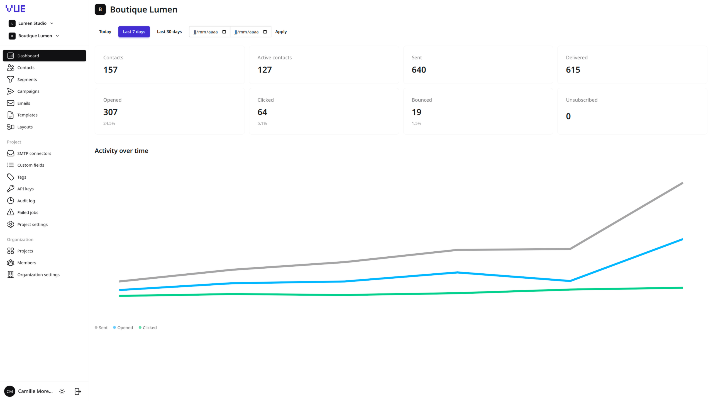
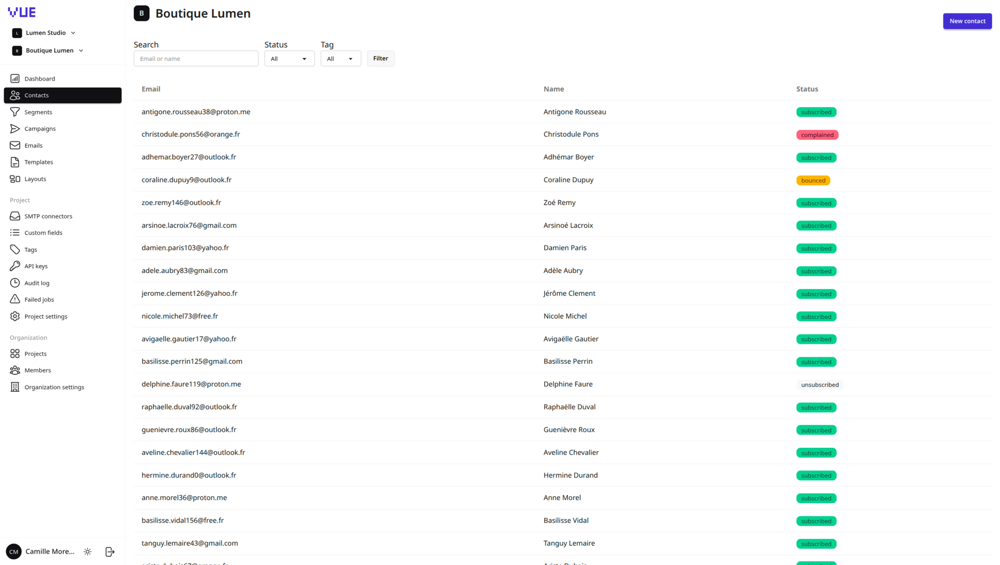
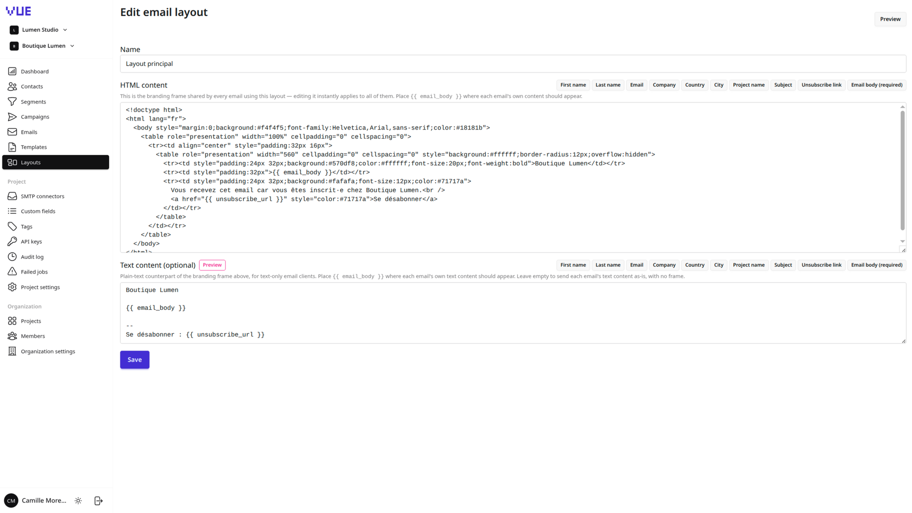
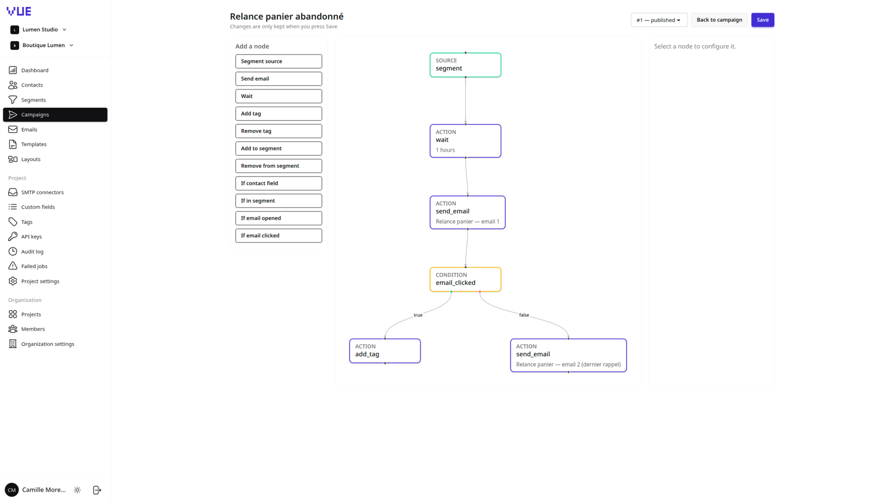
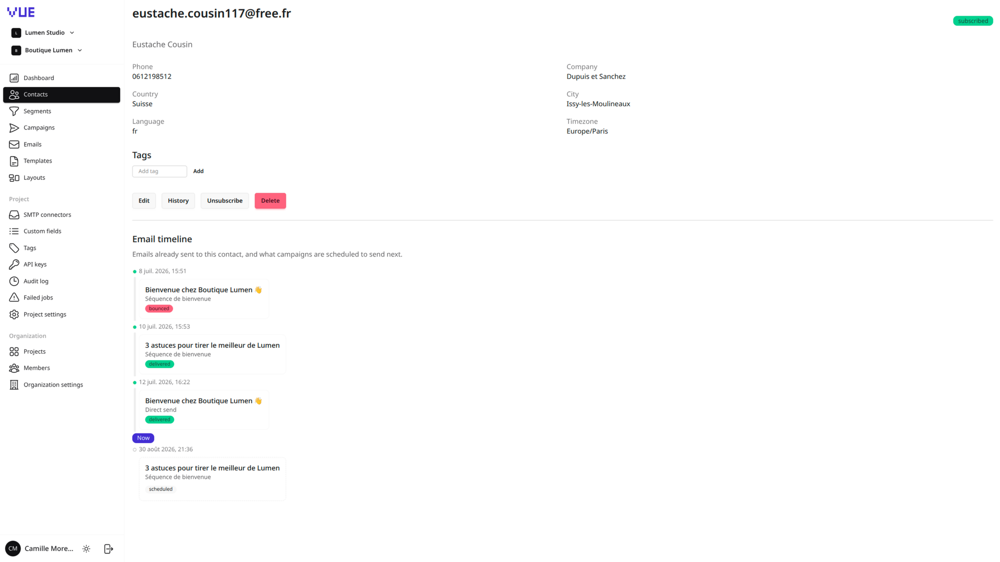
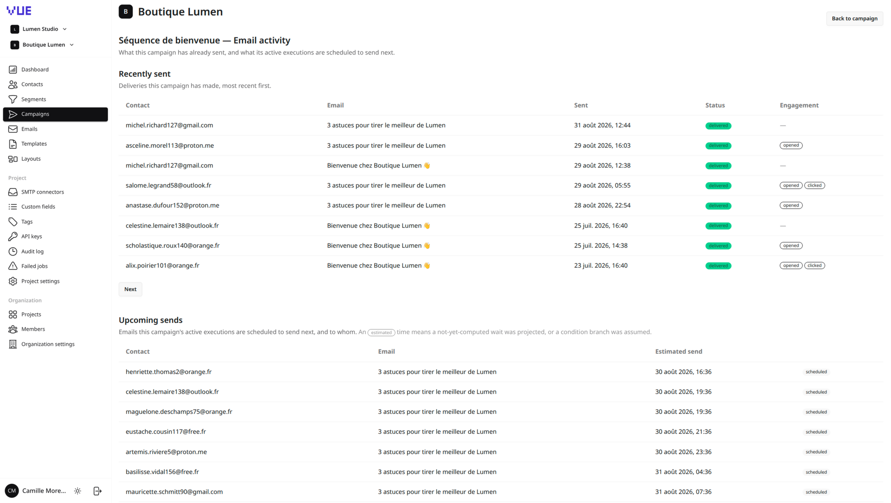

# Basalt

**Self-hosted email marketing automation, rebuilt on modern Node.js.**

Basalt is an open-source alternative to [Mautic](https://www.mautic.org/) that focuses on doing one thing well:
**email**. Contacts, dynamic segments, visual campaigns, templates, tracking and statistics — without the PHP monolith,
the plugin sprawl, or the "one global mail server for everything" model.

It is a fresh implementation on **AdonisJS 7** (Node.js ≥ 24), with a Vue 3 + Inertia SPA front-end, a typed API layer,
and a Redis/BullMQ job system that runs the heavy work (sending, segmentation, campaign progression, stats) in dedicated
worker processes.









---

## Why Basalt

### What you also get in Mautic

Basalt deliberately keeps the parts of Mautic that teams actually rely on:

- **Contact management** — CRUD, engagement status state machine (`subscribed` / `unsubscribed` /
  `bounced` / `complained` / `blocked`), soft delete, per-contact history.
- **Per-contact email timeline** — a single chronological view on the contact page merging the emails
  already sent to that contact (with delivery status and first open / first click) and the sends
  campaigns have scheduled for them next, split by a "now" marker.
- **Tags** — created on the fly, attached/detached in bulk.
- **Custom fields** — per-project field definitions, stored as JSON on the contact.
- **Dynamic segments** — a nested AND/OR filter builder over standard and custom fields, with a live match-count
  preview, persisted membership, and both targeted (on contact change) and full (scheduled) recompute.
- **Visual campaigns** — a drag-and-drop node/edge builder (source → actions → conditions), with draft / published /
  archived versioning.
- **Per-campaign email activity** — a page listing what the campaign has already sent (one row per
  contact, with delivery status and open/click engagement) next to what its active executions are
  projected to send next and to whom, each list independently paginated.
- **Email templates** — reusable starting points, previewable, duplicable.
- **Statistics & dashboards** — sends, deliveries, opens, clicks, bounces, unsubscribes, plus open/click/bounce rates,
  per project and per campaign, over `today` / 7d / 30d / custom ranges.
- **Public API** — a token-authenticated REST API, scoped per project, rate-limited.

### What Mautic doesn't give you

| Basalt                                                                                                                                                                                                                                            | Mautic                                                 |
|---------------------------------------------------------------------------------------------------------------------------------------------------------------------------------------------------------------------------------------------------|--------------------------------------------------------|
| **One or more SMTP connectors _per project_** — Brevo, Mailgun, SendGrid, SES, custom server — each with its own credentials, default connector, enable/disable toggle and optional daily send limit.                                             | A single global mail transport for the whole instance. |
| **Encrypted SMTP credentials** (AES-256-GCM, key derived from `APP_KEY`), write-only from the UI, decrypted only at send time — never sent back to the browser.                                                                                   | Credentials in global config.                          |
| **Per-project sending identity** — `senderName`, `senderEmail` and `replyTo` configurable on both the SMTP connector and the individual email.                                                                                                    | Instance-level "from" settings.                        |
| **Live email layouts** — a shared HTML branding frame (header/footer/wrapper) with an `{{ email_body }}` placeholder. Editing a layout instantly updates every email that references it — the content is _injected at render time_, never copied. | Layout changes mean re-editing each template.          |
| **One-click email translation** — clone an email machine-translated into another language (subject, preheader, HTML body, plain text), HTML structure preserved. Optional, via the Google Translate API.                                          | —                                                      |
| **Multi-organization, multi-project** with strict data isolation and per-org roles (`owner` / `admin` / `member` / `viewer`) and invitations.                                                                                                     | Single-tenant.                                         |
| **A reliable campaign engine** — enrollments and executions are persisted; `wait` steps survive restarts (a scheduler polls for due executions); every job is idempotent and retried with backoff, with a failed-jobs UI to inspect and re-run.   | —                                                      |

### Built for operators

- **Content freeze on publish** — when a campaign version is published, each `send_email` node gets a frozen copy of the
  subject/body/identity. Editing an email (or its layout) afterwards can never change what an already-running campaign
  sends.
- **Idempotent sends** — a unique `idempotency_key` per delivery plus an atomic state transition before the SMTP call
  means a retried job never double-sends.
- **Guaranteed unsubscribe** — secure per-contact token, one-click, and a _systematic_
  eligibility check before every single send (not just a UI preference).
- **Email tracking** — invisible open pixel, click-through link rewriting, and provider webhook ingestion for bounces /
  complaints / delivery confirmations (best-effort, provider-dependent).
- **Audit log** — user actions recorded at organization and project scope.
- **Sandboxed previews** — email HTML is previewed inside a sandboxed `<iframe srcdoc>`.

---

## Stack

- **Server**: AdonisJS 7 (Node.js ≥ 24)
- **Frontend**: Inertia.js + Vue 3, Tailwind CSS v4 + DaisyUI (with a light/dark theme switcher), Vue Flow for the
  campaign canvas
- **Typed client**: Tuyau (end-to-end typed routes/controllers from Vue)
- **Database**: MySQL / MariaDB via Lucid ORM
- **Queues**: BullMQ on Redis, run as separate worker + scheduler processes
- **Validation**: VineJS
- **Templating**: Edge.js (server) + a custom `{{ namespace.field }}` variable renderer for email content
- **Mail**: SMTP (Nodemailer), per-project connectors

---

## The three processes

The same build is deployed as up to three process types, all pointed at the same database and Redis. The Docker
entrypoint selects one via the `PROCESS_TYPE` env var.

| Process       | `PROCESS_TYPE`  | Role                                                                                                                                                                | Scaling                                                                                      |
|---------------|-----------------|---------------------------------------------------------------------------------------------------------------------------------------------------------------------|----------------------------------------------------------------------------------------------|
| **web**       | `web` (default) | HTTP server — the Inertia SPA and the public REST API. Runs pending migrations on start.                                                                            | N instances behind a load balancer.                                                          |
| **queue**     | `queue`         | BullMQ workers consuming the `emails`, `campaign-engine`, `segments`, `tracking` and `statistics` queues. Can consume a subset via `QUEUE_NAMES`.                   | Scale horizontally; optionally one dedicated worker per queue (e.g. a `emails`-only worker). |
| **scheduler** | `scheduler`     | Periodic tasks: nightly full segment recompute (03:00 UTC), campaign `wait`-node due-execution polling (every 60s), nightly statistics pre-aggregation (04:00 UTC). | Run **exactly one** instance.                                                                |

---

## Local development

### 1. Start local infrastructure

The dev database, cache and mail-catching tools are provided by Docker Compose:

```bash
docker compose -f docker-compose.dev.yml up -d
```

This starts:

| Service                   | Purpose                         | Port                        |
|---------------------------|---------------------------------|-----------------------------|
| MariaDB                   | main database                   | `3306`                      |
| phpMyAdmin                | DB admin UI                     | `8082`                      |
| Redis                     | queues + rate limiter           | `6379`                      |
| Mailcatcher               | catches outgoing emails, web UI | `1080` (UI) / `1025` (SMTP) |
| push-notification-catcher | catches push notifications      | `6555`                      |

### 2. Configure environment

Copy the example env file and adjust it if needed (the defaults already match the Compose services above):

```bash
cp .env.example .env
```

Generate an `APP_KEY` if `.env` doesn't have one yet:

```bash
node ace generate:key
```

Fill in `DB_HOST`, `DB_PORT`, `DB_USER`, `DB_PASSWORD`, `DB_DATABASE` to match the MariaDB container (e.g. `localhost` /
`3306` / `root` / `root` / `app`), and leave `SMTP_HOST=localhost` /
`SMTP_PORT=1025` to send mail through Mailcatcher.

`GOOGLE_TRANSLATE_API_KEY` is optional — set it only to use the "clone email into another language" feature.

### 3. Install dependencies and run migrations

```bash
npm install
node ace migration:run
```

`node ace migration:run` regenerates `database/schema.ts` — never edit that file by hand, add or change columns via a
new migration instead.

### 4. Run the app

```bash
npm run dev
```

This starts the AdonisJS server with HMR (`node ace serve --hmr`) at `http://localhost:3333`.

### 5. Run background workers (for anything that dispatches jobs)

Two long-lived processes are separate from the HTTP server:

```bash
node ace queue:work            # consumes all queues (emails, campaign-engine, segments, tracking, statistics)
node ace queue:work --queue=emails,tracking   # or a subset

node ace scheduler:run         # runs periodic tasks (see start/scheduler.ts)
```

### 6. Tests, lint, typecheck

Tests run against their own database (`.env.test` sets `DB_DATABASE=app_test`), kept empty between
tests by a per-test transaction — some specs assert on unscoped table counts, so they must never see
seeded or real data. Create and migrate it once:

```bash
docker compose -f docker-compose.dev.yml exec mariaDB \
  mariadb -uroot -proot -e "CREATE DATABASE IF NOT EXISTS app_test"
NODE_ENV=test node ace migration:run
```

```bash
node ace test              # all suites
node ace test unit         # one suite: unit | functional | browser
node ace test --files="tests/functional/some.spec.ts"

npm run lint
npm run typecheck
npm run format
```

---

## Production

### Build the Docker image

A multi-stage `Dockerfile` builds the app (`node ace build`) and produces a slim production image (production deps
only). `docker/entrypoint.sh` picks which process to run based on the
`PROCESS_TYPE` env var:

```bash
docker build -t basalt .
```

### Environment variables

Set these on the container (see `.env.example` for the full list):

- Node / App: `NODE_ENV=production`, `PORT`, `HOST`, `LOG_LEVEL`, `APP_KEY`, `APP_URL`, `TZ`
- `PROCESS_TYPE`: `web` (default), `queue`, or `scheduler` — selects what the entrypoint runs
- `QUEUE_NAMES` (queue processes only, optional): comma-separated subset of queues to consume; defaults to all
- Session: `SESSION_DRIVER`
- Database: `DB_HOST`, `DB_PORT`, `DB_USER`, `DB_PASSWORD`, `DB_DATABASE`
- Redis / limiter: `LIMITER_STORE`, `REDIS_HOST`, `REDIS_PORT`, `REDIS_PASSWORD`
- Default mail (fallback when a project has no SMTP connector): `MAIL_MAILER`, `MAIL_FROM_NAME`,
  `MAIL_FROM_ADDRESS`, `SMTP_HOST`, `SMTP_PORT`
- Optional: `GOOGLE_TRANSLATE_API_KEY` (email translation)
- Optional per-queue concurrency overrides: `QUEUE_EMAILS_CONCURRENCY`,
  `QUEUE_CAMPAIGN_ENGINE_CONCURRENCY`, `QUEUE_SEGMENTS_CONCURRENCY`, `QUEUE_TRACKING_CONCURRENCY`,
  `QUEUE_STATISTICS_CONCURRENCY`

`APP_KEY` must be a stable secret generated once (`node ace generate:key`) and reused across deploys/instances — it also
derives the key that encrypts SMTP credentials, so regenerating it per deploy makes existing sessions, encrypted data
and stored SMTP passwords unreadable.

### Run the app

The same image is deployed as (at least) three process types, each pointed at the same MySQL/MariaDB and Redis
instances:

```bash
# HTTP server
docker run --env-file .env.production -p 3333:3333 -e PROCESS_TYPE=web basalt

# Queue worker(s) — scale independently of the web process
docker run --env-file .env.production -e PROCESS_TYPE=queue basalt
docker run --env-file .env.production -e PROCESS_TYPE=queue -e QUEUE_NAMES=emails,tracking basalt

# Scheduler — run exactly one instance
docker run --env-file .env.production -e PROCESS_TYPE=scheduler basalt
```

Only one `scheduler` process should run at a time; `queue` workers can be scaled horizontally, optionally split by queue
name for isolation (e.g. a dedicated worker for `emails`).

### Migrations

The `web` entrypoint runs `node ace migration:run --force` on start. To run them as a separate one-off step instead:

```bash
docker run --env-file .env.production --rm basalt node ace migration:run --force
```

---

## Architecture

Basalt is a **modular monolith**: one AdonisJS codebase, one database schema, one build — split into domains
(`organizations`, `projects`, `contacts`, `segments`, `smtp`, `emails`, `campaigns`,
`automation`, `tracking`, `statistics`, `jobs`) rather than technical layers. Async work runs on BullMQ queues consumed
by worker processes from the same repository. Domains talk to each other through an internal event bus; listeners
enqueue jobs rather than doing heavy work inline.

The design decisions behind each domain are documented in `docs/plans/` — start with
`docs/plans/00-overview.md` and `docs/plans/01-architecture.md`, and see
`docs/plans/14-jobs-and-queues.md` for the queue/scheduler architecture and
`docs/plans/decisions/` for the structural trade-offs (campaign graph storage, segment membership, campaign versioning,
email idempotency, queue system).

---

## License

Basalt is free software, licensed under the **GNU General Public License v3.0**. See
[`LICENSE`](./LICENSE) for the full text.

Copyright (C) 2026 Basalt contributors.

This program is distributed in the hope that it will be useful, but WITHOUT ANY WARRANTY; without even the implied
warranty of MERCHANTABILITY or FITNESS FOR A PARTICULAR PURPOSE.
