# 00 — Overview

## Vision

Basalt est une plateforme de marketing automation (contacts, segmentation, emailing, campagnes visuelles) inspirée de Mautic, construite sur la stack Node.js/AdonisJS déjà en place dans ce dépôt. L'objectif n'est pas de reproduire Mautic à l'identique mais de livrer un sous-ensemble solide et cohérent : gestion de contacts, segments dynamiques, connecteurs SMTP, templates/emails, campagnes visuelles exécutées par un moteur fiable, tracking, désabonnement et statistiques — le tout multi-organisation et multi-projet.

Priorités (dans cet ordre) : **fiabilité > maintenabilité > simplicité > sécurité > observabilité > performance > scalabilité**. En cas de conflit entre "plus scalable" et "plus simple à maintenir par une petite équipe", la simplicité l'emporte sauf preuve concrète du besoin contraire.

## Scope (v1 documentée dans ces plans)

- Comptes, organisations, memberships, rôles (owner/admin/member/viewer).
- Projets, isolation stricte des données par projet.
- Contacts (CRUD, statuts, tags, custom fields en JSON).
- Segments dynamiques (constructeur de filtres AND/OR, membership persistée, recalcul par job).
- Connecteurs SMTP par projet (credentials chiffrés, connecteur par défaut, test de connexion).
- Templates d'email et emails de campagne, avec gel du contenu à la publication d'une version de campagne.
- Campagnes visuelles : builder (nodes/edges), moteur d'exécution (enrollment/execution), wait/scheduling, retry, idempotence.
- Tracking des emails (delivery status + événements opened/clicked/bounced/...).
- Désabonnement (token sécurisé, statut contact, vérification systématique avant envoi).
- Statistiques et dashboard par projet (temps réel + agrégats pré-calculés).
- Audit et logs d'exécution pour le debugging.
- Infrastructure jobs/queue (BullMQ + Redis).

## Non-scope (explicitement hors périmètre v1)

- Implémentation du canvas visuel (le composant Vue Flow lui-même) — seule l'architecture est documentée (voir `11-campaign-builder.md`).
- API publique externe / webhooks entrants (l'architecture prévoit leur point d'extension future, pas leur implémentation).
- Import de contacts en masse (CSV) — architecture évoquée, non détaillée en implémentation.
- Champs personnalisés typés relationnellement (v1 = JSON sur `contacts`) — piste d'évolution documentée.
- Multi-canal (SMS, push) — le modèle `email_events`/`email_deliveries` est nommé autour de l'email uniquement.
- Microservices, Kafka, event sourcing complet, CQRS complet, Kubernetes obligatoire.
- Toute écriture de code applicatif : cette phase est 100% documentation (`./docs/plans/` uniquement).

## Domain model (vue d'ensemble)

```text
User
 └─ OrganizationMembership (role: owner|admin|member|viewer)
      └─ Organization
           └─ Project
                ├─ Contact ── ContactTag ── Tag
                ├─ Segment ── SegmentContact (membership persistée)
                ├─ SmtpConnector
                ├─ EmailTemplate
                ├─ Email (peut référencer un EmailTemplate)
                ├─ Campaign
                │    ├─ CampaignVersion (draft | published | archived)
                │    │     ├─ CampaignNode (source | action | condition | trigger)
                │    │     └─ CampaignEdge
                │    └─ CampaignEnrollment (par Contact)
                │         └─ CampaignExecution (état runtime, current node, scheduled_at)
                │              └─ CampaignExecutionEvent (trace de debugging)
                ├─ EmailDelivery (une tentative d'envoi, idempotence)
                │    └─ EmailEvent (sent/delivered/opened/clicked/bounced/...)
                ├─ UnsubscribeToken / ContactUnsubscribeEvent
                ├─ AuditLog (actions utilisateur, échelle organisation/projet)
                └─ Statistics (agrégats projet/campagne/email, temps réel + pré-agrégés)
```

Voir `02-database-design.md` pour le détail complet des tables, colonnes, contraintes et index, et `docs/plans/decisions/` pour les arbitrages structurants.

## Main features

| # | Feature | Plan |
|---|---|---|
| 1 | Organisations, membres, rôles | `03-organizations.md` |
| 2 | Projets, isolation | `04-projects.md` |
| 3 | Contacts | `05-contacts.md` |
| 4 | Segments dynamiques | `06-segments.md` |
| 5 | Connecteurs SMTP | `07-smtp-connectors.md` |
| 6 | Templates d'email | `08-email-templates.md` |
| 7 | Emails de campagne | `09-emails.md` |
| 8 | Campagnes (modèle) | `10-campaigns.md` |
| 9 | Campaign Builder (canvas) | `11-campaign-builder.md` |
| 10 | Campaign Engine (runtime) | `12-campaign-engine.md` |
| 11 | Campaign Enrollment | `13-campaign-enrollment.md` |
| 12 | Jobs & Queues | `14-jobs-and-queues.md` |
| 13 | Retry & Idempotence | `15-retry-and-idempotency.md` |
| 14 | Email Tracking | `16-email-tracking.md` |
| 15 | Désabonnement | `17-unsubscribe.md` |
| 16 | Statistiques / Dashboard | `18-statistics-dashboard.md` |
| 17 | Sécurité | `19-security.md` |
| 18 | Observabilité / Audit | `20-observability-and-audit.md` |
| 19 | Stratégie de tests | `21-testing-strategy.md` |
| 20 | Roadmap de développement | `22-development-roadmap.md` |

## Main entities

`User`, `Organization`, `OrganizationMembership`, `OrganizationInvitation`, `Project`, `Contact`, `Tag`, `ContactTag`, `Segment`, `SegmentContact`, `SmtpConnector`, `EmailTemplate`, `Email`, `Campaign`, `CampaignVersion`, `CampaignNode`, `CampaignEdge`, `CampaignEnrollment`, `CampaignExecution`, `CampaignExecutionEvent`, `EmailDelivery`, `EmailEvent`, `UnsubscribeToken`, `ContactUnsubscribeEvent`, `AuditLog`, `CampaignDailyStat`, `ProjectDailyStat`.

## Main data flows

**Contact → Segment → Campagne → Email**

```mermaid
flowchart LR
    C[Contact créé/modifié] --> SE[Segment Evaluator]
    SE -->|ajout membership| SC[(segment_contacts)]
    SC -->|event SegmentMembershipAdded| EN[Campaign Enrollment Service]
    EN --> CE[(campaign_enrollments)]
    CE --> EX[(campaign_executions)]
    EX --> ENG[Campaign Engine]
    ENG -->|action send_email| Q[Queue: email sending]
    Q --> SMTP[SMTP Connector]
    SMTP --> ED[(email_deliveries)]
    ED -->|webhook/pixel/redirect| EV[(email_events)]
    EV --> STAT[Statistics aggregation]
```



## Architecture summary

Monolithe modulaire AdonisJS. Chaque domaine (`organizations`, `projects`, `contacts`, `segments`, `smtp`, `emails`, `campaigns`, `automation`, `tracking`, `statistics`, `jobs`) possède ses propres migrations, modèles, services, validators, controllers et pages Inertia, mais partage la même base de code, le même process HTTP et le même schéma de base de données. L'exécution asynchrone (envoi d'email, calcul de segment, avancement de campagne, agrégation de stats) passe par une queue Redis/BullMQ consommée par des workers Node séparés du process HTTP, mais issus du même repository/build. Voir `01-architecture.md` pour le détail.

## Technology decisions

| Sujet | Décision | Détail |
|---|---|---|
| Queue | BullMQ + Redis (déjà disponible en dev via `docker-compose.dev.yml`) | `decisions/ADR-002-queue-system.md` |
| Stockage du graphe de campagne | Hybride : tables relationnelles `campaign_nodes`/`campaign_edges` + colonne `config` JSON par node | `decisions/ADR-001-campaign-graph-storage.md` |
| Membership de segment | Table persistée `segment_contacts`, recalculée par job (pas de calcul dynamique par requête HTTP) | `decisions/ADR-003-segment-membership.md` |
| Versioning de campagne | `campaign_versions` (draft/published/archived), un enrollment se fige sur la version publiée au moment de l'entrée | `decisions/ADR-004-campaign-versioning.md` |
| Idempotence des envois | `email_deliveries.idempotency_key` unique + transition d'état atomique avant l'appel SMTP | `decisions/ADR-005-email-idempotency.md` |
| IDs | Auto-increment entier partout (cohérent avec `users.id` existant) ; tokens opaques séparés pour tout ce qui est exposé publiquement (désabonnement, invitations) | voir `02-database-design.md` § IDs |
| Autorisation | AdonisJS Bouncer (abilities/policies) — les alias `#policies/*`/`#abilities/*` sont déjà réservés dans `package.json` | `19-security.md` |

## Development phases

Résumé (détail complet dans `22-development-roadmap.md`) :

1. Infrastructure de base (queue, event bus interne, Bouncer)
2. Organisations
3. Projets
4. Contacts
5. SMTP Connectors
6. Templates / Emails
7. Segments (+ calcul)
8. Campagnes — modèle + versioning
9. Campaign Builder (canvas, sans lib installée pour l'instant)
10. Campaign Engine (runtime, enrollment, wait/scheduling, retry)
11. Tracking (delivery + events)
12. Désabonnement
13. Statistiques / Dashboard
14. Observabilité / Audit (transverse, renforcé en continu)

## Comment lire ces plans

Chaque document de feature (`03-*.md` à `18-*.md`) suit la structure : Objective, Functional requirements, User flows, Domain concepts, Data model, Backend architecture, Frontend architecture, Routes, Controllers, Services, Models, Jobs/Commands, Events, Permissions, Validation, Edge cases, Failure scenarios, Idempotency considerations, Performance considerations, Security considerations, Testing strategy, Implementation steps, Dependencies, Open questions.

La section **Implementation steps** est conçue pour être suffisante à elle seule : une session Claude Code future doit pouvoir recevoir `Read ./docs/plans/XX-feature.md and implement this feature.` et livrer la feature sans context supplémentaire au-delà du code existant.
