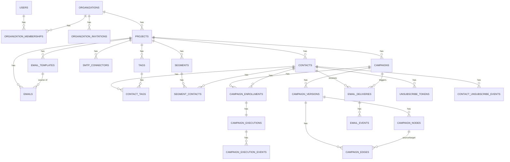

# 02 — Database Design

Ce document est la source de vérité du schéma. Les plans de feature (`03-*` à `18-*`) renvoient ici plutôt que de redéfinir les tables.

## Conventions

- **Moteur** : MySQL/MariaDB (`config/database.ts`, connexion `mysql`, driver `mysql2`), conforme à l'existant.
- **IDs** : auto-increment entier (`table.increments('id')`) sur toutes les tables, cohérent avec `users.id`. Voir § IDs plus bas pour la nuance sur les tokens publics.
- **Noms** : tables et colonnes en `snake_case` (ex. `full_name`, `created_at`), classes de schéma générées en camelCase par Lucid — identique à `UserSchema` existant.
- **Timestamps** : `created_at` (`notNullable`), `updated_at` (`nullable`, `autoUpdate`) sur toutes les tables métier, comme `users`. Tables d'événements append-only (`email_events`, `campaign_execution_events`, `audit_logs`) n'ont qu'un seul horodatage (`occurred_at`), pas de `updated_at` (elles ne sont jamais modifiées).
- **Soft delete** : uniquement sur `contacts` (colonne `deleted_at` nullable) — un contact supprimé doit rester référencé par l'historique d'envoi/événements pour l'audit et la non-réutilisation d'email en doublon ; toutes les requêtes "liste" excluent `deleted_at IS NOT NULL` par défaut via un scope de modèle. Les autres entités (segments, campagnes, templates, connecteurs SMTP) utilisent un champ de statut (`archived`, `enabled=false`, etc.) plutôt qu'un soft delete, car leur suppression logique a une sémantique métier différente de "disparu" (ex: une campagne archivée doit rester visible dans l'historique).
- **JSON** : utilisé uniquement là où la structure est intrinsèquement variable (`contacts.custom_fields`, `segments.definition`, `campaign_nodes.config`, `*.metadata`). Jamais utilisé pour des données qui ont besoin d'être filtrées/indexées efficacement en SQL (d'où les tables relationnelles pour nodes/edges et memberships plutôt que des blobs JSON — voir `decisions/ADR-001-campaign-graph-storage.md`).
- **Isolation projet** : toute table métier "de données marketing" porte une colonne `project_id` (FK `projects.id`, `notNullable`, `onDelete('CASCADE')`). Aucune requête de service ne doit lire/écrire ces tables sans filtrer par `project_id`. Voir `19-security.md`.
- **Génération** : chaque table listée ci-dessous correspond à une migration Adonis (`node ace make:migration <name>`), qui régénère `database/schema.ts` via `node ace migration:run`. Ne jamais éditer `database/schema.ts` à la main (règle déjà en vigueur dans le projet).

## IDs — analyse et décision

Le projet utilise aujourd'hui exclusivement des IDs auto-increment (`users.id`). Décision : **conserver l'auto-increment entier pour toutes les nouvelles tables**, par cohérence avec l'existant et parce que rien dans le scope v1 n'exige un ID non-séquentiel (pas de génération distribuée multi-nœuds, pas de merge inter-environnements).

Pour tout ce qui est **exposé publiquement dans une URL** (lien de désabonnement, lien d'invitation, pixel de tracking, futur webhook signé), on n'utilise **jamais** l'ID auto-increment comme identifiant public — on génère un **token opaque aléatoire** dédié (colonne `token`, `varchar(64)`, unique, généré avec un CSPRNG côté service, jamais l'ID de la ligne). Ça évite l'énumération d'IDs sans avoir à migrer tout le schéma vers UUID/ULID.

Évolution possible documentée mais non implémentée : si un besoin d'export/import inter-environnements ou d'insertion distribuée apparaît (ex. plusieurs workers qui créent des `campaign_executions` avec besoin d'ordonnancement temporel sans dépendre de l'auto-increment), migrer `contacts.id` et `campaign_executions.id` vers ULID serait le candidat naturel (triable temporellement, sans coordination). Non nécessaire pour la v1.

## Schéma — vue par domaine

### Identité / Organisations / Projets

```text
users                          (existe déjà)
  id, full_name, email, password, created_at, updated_at

organizations
  id, name, slug (unique), owner_user_id (FK users, restrict), created_at, updated_at

organization_memberships
  id, organization_id (FK, cascade), user_id (FK users, cascade),
  role (enum: owner|admin|member|viewer), invited_by_user_id (FK users, nullable),
  joined_at (nullable, null tant que l'invitation n'est pas acceptée),
  created_at, updated_at
  UNIQUE (organization_id, user_id)

organization_invitations
  id, organization_id (FK, cascade), email, role (enum),
  token (varchar 64, unique), invited_by_user_id (FK users),
  expires_at, accepted_at (nullable), revoked_at (nullable),
  created_at, updated_at
  INDEX (organization_id, email)

projects
  id, organization_id (FK, cascade), name, slug,
  timezone (varchar, ex. "Europe/Paris", défaut projet pour le scheduling — voir § Dates),
  settings (json, nullable — préférences diverses non structurantes),
  created_at, updated_at
  UNIQUE (organization_id, slug)
```

Pas de `project_memberships` en v1 : l'accès à un projet est dérivé du rôle d'organisation (voir `04-projects.md` § Permissions et l'"Open question" associée pour l'extension future vers un accès restreint par projet).

### Contacts

```text
tags
  id, project_id (FK, cascade), name, color (varchar 7, ex. "#22c55e"), created_at, updated_at
  UNIQUE (project_id, name)

contacts
  id, project_id (FK, cascade),
  email (varchar 254), first_name, last_name, phone, company, country, city,
  language (varchar 10, ex. "fr"), timezone (varchar, nullable),
  status (enum: subscribed|unsubscribed|bounced|complained|blocked),
  custom_fields (json, nullable),
  deleted_at (nullable, soft delete),
  created_at, updated_at
  UNIQUE (project_id, email)
  INDEX (project_id, status)
  INDEX (project_id, deleted_at)

contact_tags
  id, contact_id (FK, cascade), tag_id (FK, cascade), created_at
  UNIQUE (contact_id, tag_id)
```

### Segments

```text
segments
  id, project_id (FK, cascade), name, description (nullable),
  definition (json — arbre de groupes/conditions, voir 06-segments.md),
  contact_count_cache (int, défaut 0 — dernier compte connu, affiché sans recalcul),
  last_computed_at (datetime, nullable),
  last_computation_status (enum: idle|running|success|failed, défaut idle),
  created_at, updated_at

segment_contacts
  id, segment_id (FK, cascade), contact_id (FK, cascade), added_at (datetime)
  UNIQUE (segment_id, contact_id)
  INDEX (contact_id)
```

`segment_contacts` est la membership persistée (Option B / hybride, voir `decisions/ADR-003-segment-membership.md`). Pas de colonne `removed_at` : une ligne absente = non membre (suppression physique de la ligne lors du recompute), ce qui garde la table petite et les requêtes de membership triviales (`WHERE segment_id = ?`).

### SMTP

```text
smtp_connectors
  id, project_id (FK, cascade), name, host, port (smallint unsigned),
  username, password_encrypted (text — chiffré, voir 19-security.md),
  encryption (enum: none|ssl|tls), from_email, from_name, reply_to (nullable),
  is_default (boolean, défaut false), enabled (boolean, défaut true),
  daily_limit (int unsigned, nullable), last_tested_at (nullable),
  last_test_status (enum: unknown|success|failed, défaut unknown),
  created_at, updated_at
  UNIQUE (project_id, name)
```

Au plus un connecteur `is_default = true` par projet — appliqué au niveau service (transaction : désactive l'ancien défaut avant d'activer le nouveau), pas par contrainte SQL (MySQL ne supporte pas facilement un unique partiel).

### Templates / Emails

```text
email_templates
  id, project_id (FK, cascade), name, subject, html_content (longtext),
  text_content (longtext, nullable), created_at, updated_at

emails
  id, project_id (FK, cascade), email_template_id (FK email_templates, nullable, set null),
  name, subject, preheader (nullable), sender_name, sender_email, reply_to (nullable),
  html_content (longtext), text_content (longtext, nullable),
  status (enum: draft|published, défaut draft),
  created_at, updated_at
```

Un `Email` peut être créé "à partir de" un `EmailTemplate" (copie du contenu au moment de la création, pas de lien live) : voir `08-email-templates.md` et `09-emails.md`.

### Campagnes — définition (design-time)

```text
campaigns
  id, project_id (FK, cascade), name, description (nullable),
  status (enum: draft|active|paused|completed|archived, défaut draft),
  draft_version_id (FK campaign_versions, nullable, set null),
  published_version_id (FK campaign_versions, nullable, set null),
  created_at, updated_at

campaign_versions
  id, campaign_id (FK, cascade), version_number (int unsigned),
  status (enum: draft|published|archived),
  graph_format_version (smallint unsigned, défaut 1 — voir "future migration de format"),
  published_at (nullable), created_by_user_id (FK users, nullable), created_at, updated_at
  UNIQUE (campaign_id, version_number)

campaign_nodes
  id, campaign_version_id (FK, cascade), client_key (varchar 64 — id stable côté canvas),
  type (enum: source|action|condition|trigger),
  subtype (varchar 64, ex. "segment", "send_email", "wait", "add_tag", "condition_field", ...),
  config (json — payload spécifique au subtype, ex. email figé pour send_email),
  position_x (int), position_y (int),
  created_at, updated_at
  UNIQUE (campaign_version_id, client_key)

campaign_edges
  id, campaign_version_id (FK, cascade),
  source_node_id (FK campaign_nodes, cascade), target_node_id (FK campaign_nodes, cascade),
  source_handle (varchar 32, nullable — ex. "true"/"false" pour une condition, null pour défaut),
  created_at
  INDEX (campaign_version_id, source_node_id)
```

Voir `decisions/ADR-001-campaign-graph-storage.md` pour la justification du modèle hybride relationnel + JSON, et `10-campaigns.md`/`11-campaign-builder.md` pour le détail des `subtype`/`config`.

### Campagnes — exécution (runtime)

```text
campaign_enrollments
  id, project_id (FK, cascade), campaign_id (FK campaigns, cascade),
  campaign_version_id (FK campaign_versions, restrict — la version est figée à l'entrée),
  contact_id (FK contacts, cascade),
  status (enum: active|completed|exited|cancelled),
  source (varchar 64 — ex. "segment:12", origine de l'enrollment),
  enrolled_at, exited_at (nullable), exit_reason (varchar 64, nullable),
  created_at, updated_at
  UNIQUE (campaign_id, contact_id, campaign_version_id)
  INDEX (project_id, campaign_id, status)

campaign_executions
  id, campaign_enrollment_id (FK, cascade),
  current_node_id (FK campaign_nodes, nullable, set null),
  status (enum: pending|running|waiting|completed|failed|cancelled),
  scheduled_at (datetime — prochaine échéance à traiter, indexé pour le scheduler),
  started_at (nullable), finished_at (nullable),
  attempt_count (int unsigned, défaut 0), last_error (text, nullable),
  locked_at (datetime, nullable), locked_by (varchar 64, nullable — id du worker),
  lock_version (int unsigned, défaut 0 — optimistic locking),
  created_at, updated_at
  INDEX (status, scheduled_at)
  UNIQUE (campaign_enrollment_id)

campaign_execution_events
  id, campaign_execution_id (FK, cascade), node_id (FK campaign_nodes, nullable, set null),
  type (varchar 64 — ex. "node_executed", "email_queued", "condition_evaluated", "retry_scheduled"),
  message (text, nullable), metadata (json, nullable), occurred_at (datetime)
  INDEX (campaign_execution_id, occurred_at)
```

Une `campaign_enrollment` a au plus une `campaign_execution` active (`UNIQUE (campaign_enrollment_id)`) : un ré-enrollment (nouvelle entrée après sortie) crée une **nouvelle ligne** `campaign_enrollments` (pas de réutilisation), ce qui garde l'historique complet. Voir `13-campaign-enrollment.md`.

### Tracking / Delivery

```text
email_deliveries
  id, project_id (FK, cascade),
  campaign_id (FK campaigns, nullable, set null),
  campaign_execution_id (FK campaign_executions, nullable, set null),
  email_id (FK emails, nullable, set null),
  contact_id (FK contacts, cascade),
  smtp_connector_id (FK smtp_connectors, nullable, set null),
  idempotency_key (varchar 128, unique — voir 15-retry-and-idempotency.md),
  provider_message_id (varchar 255, nullable),
  status (enum: pending|queued|processing|sent|delivered|failed|bounced),
  attempt_count (int unsigned, défaut 0), last_error (text, nullable),
  sent_at (nullable), delivered_at (nullable),
  created_at, updated_at
  INDEX (project_id, status, created_at)
  INDEX (contact_id)

email_events
  id, project_id (FK, cascade), email_delivery_id (FK email_deliveries, cascade),
  contact_id (FK contacts, cascade),
  type (enum: sent|delivered|opened|clicked|bounced|complained|failed|unsubscribed),
  metadata (json, nullable — ex. user-agent, url cliquée, code d'erreur SMTP),
  occurred_at (datetime)
  INDEX (email_delivery_id, type)
  INDEX (project_id, type, occurred_at)
```

`email_deliveries.status` = état de la **remise** (pipeline pending→queued→processing→sent/failed, puis delivered/bounced quand le provider confirme). `email_events` = **journal d'événements**, append-only, y compris des types qui ne changent pas le statut de delivery (`opened`, `clicked` peuvent arriver plusieurs fois). Ne jamais dériver le statut de delivery en comptant des lignes `email_events` — les deux concepts sont mis à jour indépendamment (voir `16-email-tracking.md`).

### Désabonnement

```text
unsubscribe_tokens
  id, project_id (FK, cascade), contact_id (FK contacts, cascade),
  token (varchar 64, unique), created_at, used_at (nullable)
  INDEX (contact_id)

contact_unsubscribe_events
  id, project_id (FK, cascade), contact_id (FK contacts, cascade),
  campaign_id (FK campaigns, nullable, set null),
  source (enum: link|manual|bounce|complaint|api),
  reason (varchar 255, nullable), occurred_at (datetime)
```

### Audit / Statistiques

```text
audit_logs
  id, organization_id (FK, cascade), project_id (FK projects, nullable, set null — null pour une action au niveau organisation),
  actor_user_id (FK users, nullable — null si action système/worker),
  action (varchar 100 — ex. "campaign.published", "smtp_connector.created"),
  entity_type (varchar 100, nullable), entity_id (int unsigned, nullable),
  metadata (json, nullable), occurred_at (datetime)
  INDEX (organization_id, occurred_at)
  INDEX (project_id, occurred_at)

campaign_daily_stats
  id, project_id (FK, cascade), campaign_id (FK campaigns, cascade), date (date),
  sent, delivered, opened, clicked, bounced, failed, unsubscribed (int unsigned, défaut 0 chacun),
  created_at, updated_at
  UNIQUE (campaign_id, date)

project_daily_stats
  id, project_id (FK, cascade), date (date),
  contacts_total, contacts_active, emails_sent, emails_delivered, emails_opened,
  emails_clicked, emails_bounced, emails_failed, unsubscribes (int unsigned, défaut 0 chacun),
  created_at, updated_at
  UNIQUE (project_id, date)
```

Voir `18-statistics-dashboard.md` pour la stratégie temps réel ("today") vs pré-agrégé (historique).

## ERD (Mermaid, vue simplifiée)



## Dates et timezones

- **Base de données** : tout est stocké en **UTC** (`config/app.ts` / connexion MySQL en UTC — à vérifier/forcer lors de l'implémentation, ex. `timezone: 'Z'` dans la config `mysql2`). Toutes les colonnes `datetime`/`timestamp` sont des instants UTC.
- **Projet** : `projects.timezone` définit le fuseau de référence pour la **planification** (ex. "Wait until 09:00" s'interprète dans le fuseau du projet, pas celui du serveur ni de l'utilisateur qui édite la campagne).
- **Contact** : `contacts.timezone` (optionnel) peut surcharger le fuseau projet pour un envoi "au meilleur moment local" — feature envisageable plus tard (le champ existe dès la v1 pour éviter une migration future, mais son usage dans le Campaign Engine n'est pas implémenté en v1 ; le moteur utilise le fuseau du projet).
- **Affichage** : le frontend affiche toujours dans le fuseau du navigateur de l'utilisateur (conversion faite côté client à partir de l'UTC renvoyé par l'API), sauf pour les écrans de configuration de campagne où l'heure saisie est explicitement libellée "heure du projet (Europe/Paris)".
- **Calcul de `scheduled_at`** (wait nodes) : toujours calculé et stocké en UTC côté serveur au moment où le nœud "Wait" est atteint, à partir de l'offset du fuseau projet résolu à cet instant (attention aux changements d'heure été/hiver : utiliser Luxon, déjà une dépendance du projet, avec `DateTime.now().setZone(project.timezone)` plutôt que des calculs d'offset manuels).

## Vérification de cohérence

- Toutes les tables "de données marketing" ont bien `project_id`, sauf les tables purement liées à l'exécution qui dérivent leur projet via `campaign_enrollment`/`campaign_execution` (on dénormalise quand même `project_id` sur `campaign_enrollments` et `email_deliveries` pour permettre un filtrage direct sans jointure sur les écrans de liste/stats — compromis performance documenté, pas une incohérence).
- Aucune contrainte `UNIQUE` globale sur `email` (seulement `UNIQUE (project_id, email)` sur `contacts`) — un même email peut exister dans plusieurs projets, ce sont des contacts différents.
- Toutes les FK vers une entité "parente forte" (projet, organisation, campagne, segment, contact) sont en `CASCADE` ; les FK vers une entité "référentielle optionnelle" (template, connecteur SMTP, node courant) sont en `SET NULL`/`RESTRICT` pour ne jamais perdre d'historique silencieusement.
