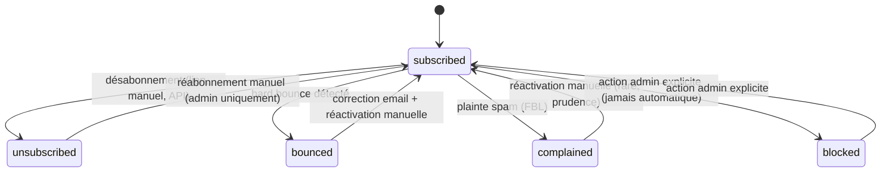

# 05 — Contacts

## Objective

Gérer les contacts d'un projet : création, édition, suppression logique, consultation, recherche, filtres, tags, statut d'engagement email — la donnée centrale sur laquelle segments et campagnes opèrent.

## Functional requirements

- CRUD contact (création manuelle, édition, suppression logique).
- Consultation détaillée d'un contact : champs standards, tags, custom fields, historique (segments membres, campagnes engagées, emails reçus/événements — lecture croisée avec les domaines correspondants).
- Liste paginée, recherche (email/nom), filtres (statut, tag, segment).
- Tags : création à la volée, association/dissociation multiple.
- Statut du contact : `subscribed`, `unsubscribed`, `bounced`, `complained`, `blocked` (voir Domain concepts pour la state machine).
- Champs standards : `email`, `firstName`, `lastName`, `phone`, `company`, `country`, `city`, `language`, `timezone`, `status`, `createdAt`, `updatedAt`.
- Champs personnalisés : `customFields` JSON en v1 (voir Open questions pour l'évolution relationnelle).
- Import : hors scope d'implémentation v1, architecture évoquée uniquement (voir Open questions).

## User flows

**Création manuelle** : formulaire → validation (email unique dans le projet) → `Contact` créé avec `status = subscribed` → événement `ContactCreated` émis → déclenche le recalcul ciblé de segments (`06-segments.md`).

**Édition** : formulaire pré-rempli → validation → `Contact` mis à jour → si un champ référencé par au moins une définition de segment a changé, événement `ContactUpdated` émis avec la liste des champs modifiés → recalcul ciblé des segments concernés.

**Suppression** : action "Supprimer" → confirmation → `deleted_at` renseigné (soft delete) → le contact disparaît de toutes les listes/segments (scope de modèle par défaut exclut `deleted_at IS NOT NULL`), mais reste référencé par l'historique `email_deliveries`/`email_events`/`campaign_enrollments` pour l'audit — voir Edge cases pour le comportement des enrollments actifs.

## Domain concepts

**State machine de `contacts.status`** (statut d'engagement email, distinct des `email_events` qui journalisent des occurrences) :



Règle transverse : **le Campaign Engine vérifie toujours `status == 'subscribed'` avant d'exécuter un node `send_email`** (voir `12-campaign-engine.md` § Edge cases et `17-unsubscribe.md`) — aucun autre statut n'autorise l'envoi. `blocked` est un statut manuel séparé de `bounced`/`complained` pour couvrir un besoin admin (ex. contact frauduleux/plainte légale) sans le confondre avec une donnée de délivrabilité.

**Custom fields (v1)** : colonne `contacts.custom_fields` (JSON, `{ [key: string]: string | number | boolean | null }`). Pas de définition de schéma par projet en v1 (pas de table `project_custom_field_definitions`) — les clés sont libres, saisies par l'utilisateur. Les segments peuvent filtrer sur `custom_fields.<key>` via un opérateur JSON (`JSON_EXTRACT`), documenté comme moins performant qu'un champ standard indexé (voir Performance considerations) mais suffisant pour la v1.

## Data model

Voir `02-database-design.md` § Contacts (`contacts`, `tags`, `contact_tags`). Rappels :

- `UNIQUE (project_id, email)` — un email est unique par projet, pas globalement.
- `INDEX (project_id, status)` pour les listes filtrées par statut (l'écran de liste par défaut filtre `status = subscribed` ou "tous" — les deux doivent rester rapides).
- Soft delete via `deleted_at` — voir `02-database-design.md` § Conventions pour la justification (seule entité du domaine avec soft delete).

## Backend architecture

```text
app/services/contacts/
  contact_service.ts        (create, update, softDelete, restore, bulkTag)
  contact_query_service.ts  (recherche/filtres/pagination — logique de query isolée du controller)
app/validators/contact.ts
app/transformers/contact_transformer.ts, tag_transformer.ts
app/events/contact_created.ts, contact_updated.ts, contact_deleted.ts
```

## Frontend architecture

```text
inertia/pages/.../contacts/
  index.vue    (table paginée, recherche, filtres statut/tag/segment)
  show.vue     (détail : infos, tags, custom fields, onglets historique)
  create.vue
  edit.vue
inertia/components/contact-status-badge.vue
inertia/components/tag-picker.vue
```

Liste : pagination server-side (via `ctx.serialize()` + le format de pagination Lucid déjà géré par `ApiSerializer`, voir `providers/api_provider.ts`), recherche/filtres en query string synchronisés avec l'URL (permet de partager un lien filtré).

## Routes

```text
GET    .../contacts                 contacts.index
GET    .../contacts/create           contacts.create
POST   .../contacts                  contacts.store
GET    .../contacts/:contactId       contacts.show
GET    .../contacts/:contactId/edit  contacts.edit
PATCH  .../contacts/:contactId       contacts.update
DELETE .../contacts/:contactId       contacts.destroy
POST   .../contacts/:contactId/tags  contacts.tags.attach
DELETE .../contacts/:contactId/tags/:tagId contacts.tags.detach
```

(`...` = préfixe `/organizations/:organizationId/projects/:projectId`, cf. `04-projects.md`, appliqué à toutes les routes de domaine des plans suivants — non répété systématiquement dans chaque plan.)

## Controllers

`ContactsController` (index/create/store/show/edit/update/destroy), `ContactTagsController` (attach/detach). Le controller `index` délègue entièrement le filtrage/recherche/pagination à `ContactQueryService.paginate(project, filters)`.

## Services

- `ContactService.create(project, payload)` : vérifie l'unicité email dans le projet (erreur de validation propre, pas une 500 sur contrainte SQL), émet `ContactCreated`.
- `ContactService.update(contact, payload)` : calcule le diff des champs modifiés, émet `ContactUpdated` avec la liste des champs (utilisée par `06-segments.md` pour le recalcul ciblé).
- `ContactService.softDelete(contact)` : renseigne `deleted_at` ; si le contact a des `campaign_enrollments` avec `status = active`, les marque `cancelled` (`exit_reason = 'contact_deleted'`) dans la même transaction — voir Edge cases.
- `ContactQueryService.paginate(project, filters)` : construit la requête à partir de `search`, `status`, `tagId`, `segmentId` (jointure sur `segment_contacts` si fourni).

## Models

`Contact` (relations : `project`, `tags` via `contact_tags`, `segmentMemberships`, `enrollments`, `deliveries`). Scopes nommés : `Contact.query().forProject(project)` (filtre `project_id` + exclut `deleted_at IS NOT NULL` par défaut), `.withStatus(status)`, `.eligibleForSending()` (raccourci pour `status = 'subscribed'`).

`Tag` (relations : `project`, `contacts`).

## Jobs / Commands

Aucun job dédié à ce domaine (le recalcul de segment déclenché par `ContactCreated`/`ContactUpdated` est de la responsabilité de `06-segments.md`). Aucune command ace en v1 (l'import CSV, non implémenté, serait une command + job — voir Open questions).

## Events

`ContactCreated`, `ContactUpdated` (payload : `contact`, `changedFields: string[]`), `ContactDeleted`. Écoutés par : le listener de recalcul ciblé de segments (`06-segments.md`), `AuditLogListener` (`20-observability-and-audit.md`).

## Permissions

Standard projet : `owner`/`admin`/`member` peuvent créer/éditer/supprimer ; `viewer` lecture seule (voir `19-security.md` pour la matrice générique appliquée à tous les domaines projet, non répétée dans chaque plan sauf exception).

## Validation

`app/validators/contact.ts` :
- `createContactValidator` : `email` (unique par projet — règle custom, pas la règle `unique` globale de VineJS qui ne connaît pas le scope projet), `firstName`/`lastName`/`phone`/`company`/`country`/`city` optionnels string, `language` string ISO 639-1 (2 lettres), `timezone` optionnel string IANA, `customFields` objet libre (clés string, valeurs scalaires, profondeur 1 imposée — pas de JSON imbriqué arbitraire, pour garder les filtres de segment simples).
- `updateContactValidator` : mêmes règles, `email` unique par projet **excluant** le contact courant.

## Edge cases

- Contact avec `campaign_enrollments` actifs supprimé → enrollments passés à `cancelled` (voir Services ci-dessus), le Campaign Engine ne doit jamais tenter d'agir sur un contact soft-deleted (vérification supplémentaire défensive dans le moteur, pas seulement une confiance dans cette transition).
- Email dupliqué dans le même projet → erreur de validation, jamais de merge automatique (le merge de contacts est hors scope v1).
- Contact restauré (si une UI de restauration existe) → `deleted_at = null`, ne réactive pas automatiquement d'anciens enrollments annulés.
- Recherche/filtre combiné statut + tag + segment → toutes les conditions sont en AND (pas d'UI de requête complexe sur la liste elle-même ; c'est le rôle des segments, cf. `06-segments.md`).

## Failure scenarios

- Écriture concurrente sur le même contact (deux admins éditent en même temps) → dernier écrivain gagne (pas de verrouillage optimiste sur `contacts` en v1 — volumétrie de contention jugée négligeable pour ce cas d'usage) ; documenté explicitement comme compromis simplicité vs. robustesse.

## Idempotency considerations

Les opérations CRUD standard n'ont pas de besoin d'idempotence particulier au-delà de la validation d'unicité email. Le besoin d'idempotence fort du domaine contact concerne le futur import CSV (hors implémentation v1) : une ré-exécution du même fichier ne doit pas créer de doublons — à traiter via upsert sur `(project_id, email)` le moment venu.

## Performance considerations

- `contacts (project_id, email)` unique index sert à la fois la contrainte et la recherche exacte.
- `contacts (project_id, status)` sert les listes filtrées et le comptage utilisé par les statistiques (`18-statistics-dashboard.md`).
- Filtre sur `custom_fields.<key>` (JSON) : acceptable pour des filtres ponctuels sur un projet de taille modérée ; **non indexé** en v1 (pas de colonne générée MySQL dédiée) — à surveiller si des projets à fort volume (100k+) l'utilisent massivement dans des segments (piste d'évolution : colonnes générées MySQL indexées pour les clés custom les plus utilisées, décidé plan tard avec des données réelles, pas anticipé ici).
- Pagination toujours par curseur/offset standard Lucid (`paginate()`), jamais de chargement complet en mémoire.

## Security considerations

- `email` jamais utilisé comme identifiant dans une URL publique (le désabonnement utilise un token dédié, voir `17-unsubscribe.md`).
- `customFields` : valeurs échappées correctement à l'affichage (Vue échappe par défaut) — attention particulière si un jour ces valeurs sont interpolées dans un template email HTML (voir `19-security.md` § XSS templates).

## Testing strategy

- Unit : `ContactService` (unicité email par projet, diff de champs modifiés, cascade sur soft delete d'enrollments actifs).
- Functional : CRUD complet, recherche/filtres combinés, isolation projet (contact d'un projet A invisible pour projet B, y compris via recherche par email).
- Regression : la state machine de statut (transitions autorisées/refusées) testée explicitement.

## Implementation steps

1. `node ace make:migration create_tags_table`.
2. `node ace make:migration create_contacts_table`.
3. `node ace make:migration create_contact_tags_table`.
4. `node ace migration:run`.
5. Créer les modèles `Contact`, `Tag` (relations, scopes `forProject`, `withStatus`, `eligibleForSending`).
6. Créer `app/validators/contact.ts` (règle custom d'unicité email scopée projet).
7. Créer `app/events/contact_created.ts`, `contact_updated.ts`, `contact_deleted.ts`.
8. Créer `app/services/contacts/contact_service.ts` et `contact_query_service.ts`.
9. Créer `app/transformers/contact_transformer.ts`, `tag_transformer.ts`.
10. Créer `ContactsController`, `ContactTagsController` et les routes dans `start/routes.ts` (sous le préfixe projet).
11. Créer les pages Inertia et composants listés ci-dessus.
12. Écrire les tests listés ci-dessus.

## Dependencies

`04-projects.md` (contexte projet, `project_context_middleware`).

## Open questions

- Custom fields relationnels typés (table `project_custom_field_definitions` + table de valeurs) : piste d'évolution si le JSON devient limitant (filtrage/indexation) ou si une validation de type stricte par champ est demandée par les utilisateurs — non implémenté en v1, la forme JSON actuelle n'empêche pas cette migration ultérieure (les clés resteraient les mêmes).
- Import CSV : nécessiterait une command/job dédié avec upsert idempotent par `(project_id, email)`, une UI de mapping de colonnes, et une stratégie de rapport d'erreurs ligne par ligne — non détaillé ici, à documenter dans un plan dédié si/quand priorisé.
- Merge de contacts dupliqués (au-delà de la contrainte d'unicité stricte) : non traité en v1.
