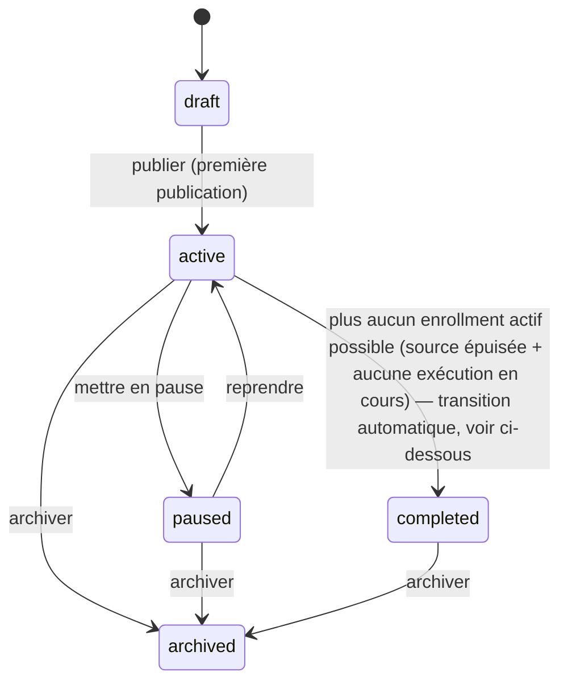

# 10 — Campaigns

## Objective

Définir le modèle `Campaign` : son cycle de vie (statut), sa relation au versioning (`decisions/ADR-004-campaign-versioning.md`), et les opérations de gestion de haut niveau (créer, activer, mettre en pause, archiver) — indépendamment du détail du canvas (`11-campaign-builder.md`) et du moteur d'exécution (`12-campaign-engine.md`), qui sont des plans séparés par construction (design vs. runtime, cf. `init.md`).

## Functional requirements

- Créer une campagne (nom, description) → crée automatiquement une `campaign_version` `draft` vide.
- Lister/consulter les campagnes d'un projet, avec leur statut et un résumé d'activité (contacts actuellement engagés, taux basique — détail complet dans `18-statistics-dashboard.md`).
- Activer une campagne (publie le draft courant → `published`, campagne passe `active`).
- Mettre en pause / reprendre une campagne active.
- Archiver une campagne (terminée définitivement).
- Dupliquer une campagne (nouvelle campagne, nouveau draft cloné, jamais liée à l'originale).

## User flows

```text
Création : nom + description
  → Campaign créée (status='draft'), CampaignVersion #1 créée (status='draft', vide)
  → redirection vers le Campaign Builder (11-campaign-builder.md) pour construire le graphe

Activation ("Publier") : disponible une fois le draft validé (voir 11-campaign-builder.md
  § Validation pour les règles de graphe valide : au moins un node source, pas de node orphelin, etc.)
  → CampaignBuilderService.publish(draftVersion) exécuté (decisions/ADR-004-campaign-versioning.md)
  → Campaign.status: draft -> active

Pause : action "Mettre en pause" sur une campagne active
  → Campaign.status: active -> paused
  → voir Domain concepts pour le comportement précis des exécutions en cours

Reprise : action "Reprendre" sur une campagne paused
  → Campaign.status: paused -> active
  → les campaign_executions en 'waiting' dont scheduled_at est déjà passé sont re-planifiées
    immédiatement (voir 12-campaign-engine.md)

Archivage : action "Archiver" (depuis active/paused/completed)
  → Campaign.status: * -> archived
  → toutes les campaign_executions actives sont marquées 'cancelled' (exit_reason='campaign_archived')
```

## Domain concepts

**État d'une campagne** :



Une campagne republiée (nouveau draft publié par-dessus une version déjà `published`) reste `active` — republier ne fait pas transiter `draft -> active` une deuxième fois, seule la première publication le fait (les publications suivantes sont "Campaign already active, republishing version N").

**Comportement en pause (question explicitement posée dans `init.md`)** — décision explicite : les jobs déjà planifiés (`campaign_executions` en `waiting` avec un `scheduled_at` futur) **ne sont ni supprimés ni exécutés** : ils restent en base tels quels. Le worker qui traite les executions dues vérifie, **juste avant d'agir**, que `campaign.status == 'active'` ; si `paused`, il **repousse silencieusement** l'exécution (aucune action, aucune erreur, ré-évaluée à la prochaine passe du scheduler) plutôt que de la faire échouer ou de la supprimer. Ce choix (plutôt que "supprimer les jobs en attente" ou "les exécuter quand même") est retenu car :
- Supprimer perdrait l'état d'avancement du contact dans le workflow (il faudrait le ré-enroller de zéro à la reprise).
- Exécuter quand même contredirait le sens même de "pause" pour l'utilisateur.
- Repousser silencieusement est réversible et ne nécessite aucune structure de données supplémentaire (pas de file d'attente séparée à gérer).

Voir `12-campaign-engine.md` § Edge cases pour l'implémentation précise de cette vérification.

**Transition automatique `active -> completed`** : évaluée par un job périodique léger (pas à chaque exécution individuelle) qui vérifie, pour chaque campagne `active`, l'absence de `campaign_enrollments.status = 'active'` **et** l'absence de nouvelle source d'enrollment possible (ex. le segment source n'a plus de membres non-déjà-enrollés, sous réserve de la politique de ré-entrée — voir `13-campaign-enrollment.md`). En pratique, une campagne avec un segment source dynamique (des contacts peuvent y entrer à tout moment) **ne devient jamais `completed` automatiquement** en v1 tant qu'elle reste `active` — la transition automatique concerne surtout un usage futur de sources "figées" (ex. import ponctuel). Pour la v1, `completed` est donc principalement atteint **manuellement** (action utilisateur équivalente à "arrêter la campagne sans l'archiver") ; la transition automatique est documentée comme piste, pas comme un mécanisme garanti en v1 — voir Open questions.

## Data model

Voir `02-database-design.md` § Campagnes — définition (`campaigns`, `campaign_versions`) ; `campaign_nodes`/`campaign_edges` détaillés dans `11-campaign-builder.md` ; `campaign_enrollments`/`campaign_executions` détaillés dans `13-campaign-enrollment.md`/`12-campaign-engine.md`.

## Backend architecture

```text
app/services/campaigns/
  campaign_service.ts   (create, duplicate, pause, resume, archive — PAS publish/save du graphe,
                          qui vivent dans CampaignBuilderService, 11-campaign-builder.md)
app/validators/campaign.ts
app/transformers/campaign_transformer.ts, campaign_version_transformer.ts
app/events/campaign_activated.ts, campaign_paused.ts, campaign_resumed.ts, campaign_archived.ts, campaign_completed.ts
```

## Frontend architecture

```text
inertia/pages/.../campaigns/
  index.vue    (liste, statut, résumé d'activité)
  create.vue   (nom + description, redirige vers le builder après création)
  show.vue     (vue d'ensemble : statut, stats, historique de versions, actions pause/resume/archive)
  builder.vue  (le canvas lui-même — voir 11-campaign-builder.md, architecture frontend détaillée là-bas)
```

`show.vue` est la page "gestion" d'une campagne (statut, actions de cycle de vie, lien vers le builder et vers les statistiques détaillées) — distincte de `builder.vue` qui est l'éditeur visuel du graphe.

## Routes

```text
GET    .../campaigns                      campaigns.index
GET    .../campaigns/create                 campaigns.create
POST   .../campaigns                        campaigns.store
GET    .../campaigns/:campaignId            campaigns.show
POST   .../campaigns/:campaignId/duplicate  campaigns.duplicate
POST   .../campaigns/:campaignId/activate   campaigns.activate
POST   .../campaigns/:campaignId/pause      campaigns.pause
POST   .../campaigns/:campaignId/resume     campaigns.resume
POST   .../campaigns/:campaignId/archive    campaigns.archive
```

(Routes du builder — édition du graphe — définies dans `11-campaign-builder.md`.)

## Controllers

`CampaignsController` (index/create/store/show/duplicate/activate/pause/resume/archive). Fin, délègue à `CampaignService`. `activate` délègue en réalité à `CampaignBuilderService.publish()` (cf. `11-campaign-builder.md`) après vérification de validité du graphe — `CampaignService` orchestre l'appel mais ne réimplémente pas la logique de publication.

## Services

- `CampaignService.create(project, payload)` : transaction (crée `Campaign` + `CampaignVersion` draft vide, `campaigns.draft_version_id` renseigné).
- `CampaignService.duplicate(campaign)` : nouvelle `Campaign` (status='draft'), nouvelle `CampaignVersion` draft avec nodes/edges clonés depuis la version actuellement affichée (published si elle existe, sinon draft) de l'originale — jamais de lien vers l'originale après duplication.
- `CampaignService.pause(campaign)` / `resume(campaign)` : transition de statut simple + émission d'event ; aucune modification des `campaign_executions` (cf. Domain concepts).
- `CampaignService.archive(campaign)` : transition + annulation en masse des `campaign_enrollments`/`campaign_executions` actifs (transaction par lots si volumineux — réutilise le pattern de traitement par lots de `06-segments.md`).

## Models

`Campaign` (relations : `project`, `versions`, `draftVersion`, `publishedVersion`, `enrollments`). Scope nommé `Campaign.query().forProject(project)`, `.active()`.

`CampaignVersion` (relations : `campaign`, `nodes`, `edges`, `enrollments`) — détail complet des relations nodes/edges dans `11-campaign-builder.md`.

## Jobs / Commands

```text
job: campaign.archive_cascade { campaignId }
  -- annulation par lots des enrollments/executions actifs, si le volume dépasse un seuil traité
     de façon synchrone (même logique de seuil que la suppression de projet, 04-projects.md)

job (périodique, léger): campaign.check_completion
  -- évalue la transition active -> completed pour les campagnes concernées (voir Domain concepts,
     Open questions sur la portée réelle de cette automatisation en v1)
```

## Events

`CampaignActivated`, `CampaignPaused`, `CampaignResumed`, `CampaignArchived`, `CampaignCompleted` — consommés par `AuditLogListener` (`20-observability-and-audit.md`) et par `18-statistics-dashboard.md` (invalidation de caches d'agrégats si applicable).

## Permissions

Standard projet, avec activation/pause/archive réservées à `owner`/`admin`/`member` (pas `viewer`) — cohérent avec la matrice générique (`19-security.md`).

## Validation

`app/validators/campaign.ts` : `createCampaignValidator` (`name`, `description` optionnelle). Les transitions de statut n'ont pas de validator de payload (actions sans corps), mais sont vérifiées côté service (ex. `activate` refuse si déjà `archived`).

## Edge cases

- Activation d'un draft dont le graphe est invalide (pas de node source, node orphelin sans edge entrante hors source, condition sans les deux branches connectées) → refusée avec la liste des erreurs de validation du graphe (détail dans `11-campaign-builder.md` § Validation), jamais une publication partielle.
- Pause d'une campagne déjà `paused` / reprise d'une campagne déjà `active` → idempotent, pas d'erreur (no-op avec message informatif).
- Archivage d'une campagne `draft` (jamais activée) → autorisé directement (pas d'enrollments à annuler, transition simple `draft -> archived`).
- Duplication d'une campagne dont la version affichée est `published` → le nouveau draft cloné part de cet état "figé" (copie du graphe tel que publié, y compris les `config` déjà figés des nodes `send_email` — donc les emails copiés sont eux-mêmes des copies figées, pas des références aux `Email` originaux qui pourraient avoir changé depuis).

## Failure scenarios

- Crash pendant l'archivage en cascade d'une campagne à fort volume d'enrollments → le job `campaign.archive_cascade` est repris via le mécanisme de retry générique ; conçu pour être idempotent (annuler un enrollment déjà `cancelled` est un no-op) — voir `15-retry-and-idempotency.md`.

## Idempotency considerations

Toutes les transitions de statut (`activate`, `pause`, `resume`, `archive`) sont idempotentes au niveau service : ré-appeler la même action sur un état déjà atteint ne produit pas d'erreur ni d'effet de bord dupliqué (pas de double emission d'event si l'état ne change effectivement pas — vérification explicite avant émission).

## Performance considerations

Le "résumé d'activité" affiché en liste (`campaigns.index`) doit s'appuyer sur des comptes pré-calculés/indexés (`campaign_enrollments (campaign_id, status)` indexé, cf. `02-database-design.md`) plutôt que des agrégations coûteuses par ligne de liste — voir `18-statistics-dashboard.md` pour la stratégie de statistiques détaillée.

## Security considerations

Standard projet (`19-security.md`). Point spécifique : l'archivage cascade doit vérifier l'appartenance projet de chaque enrollment traité par lot (défense en profondeur, même si la requête de sélection des lots est déjà scopée par `campaign_id` qui appartient lui-même au projet — pas de raccourci qui contournerait le scoping).

## Testing strategy

- Unit : `CampaignService` (cycle de vie complet, idempotence de chaque transition, règles de duplication).
- Functional : parcours création → builder → activation → pause → reprise → archivage, avec vérification des `campaign_executions` à chaque étape (notamment le comportement "silencieusement repoussé" en pause, testé de bout en bout avec le moteur — test partagé avec `12-campaign-engine.md`).
- Regression : activation bloquée sur un graphe invalide (cas listés en Edge cases).

## Implementation steps

1. `node ace make:migration create_campaigns_table`.
2. `node ace make:migration create_campaign_versions_table`.
3. `node ace migration:run`.
4. Créer les modèles `Campaign`, `CampaignVersion` (relations, scopes).
5. Créer `app/validators/campaign.ts`.
6. Créer `app/services/campaigns/campaign_service.ts` (create/duplicate/pause/resume/archive — `publish` délégué à `11-campaign-builder.md`, implémenté dans ce plan-ci mais appelé depuis `CampaignsController.activate`).
7. Créer les events (`app/events/campaign_*.ts`).
8. Créer `app/transformers/campaign_transformer.ts`, `campaign_version_transformer.ts`.
9. Créer `CampaignsController` et les routes (hors routes du builder, cf. `11-campaign-builder.md`).
10. Créer les pages Inertia `index.vue`, `create.vue`, `show.vue` (pas `builder.vue`, cf. plan suivant).
11. Créer le job `campaign.archive_cascade` (dépend de `14-jobs-and-queues.md`).
12. Écrire les tests listés ci-dessus (hors tests qui nécessitent le graphe/moteur, qui vivent dans les plans suivants une fois ceux-ci implémentés).

## Dependencies

`04-projects.md`. Ce plan définit le modèle `Campaign`/`CampaignVersion` mais ne peut être **pleinement** testé de bout en bout qu'une fois `11-campaign-builder.md` (construction du graphe) et `12-campaign-engine.md` (exécution) implémentés — voir `22-development-roadmap.md` pour l'ordre recommandé (ce plan sert de fondation aux deux suivants, implémenté en premier mais complété par eux).

## Open questions

- Portée réelle de la transition automatique `active -> completed` : à réévaluer une fois des sources de campagne autres que "segment dynamique" existent (ex. une future source "liste figée d'IDs importés" rendrait cette transition naturellement atteignable automatiquement). En v1, considérer `completed` comme majoritairement une action manuelle.
- Faut-il autoriser plusieurs sources sur une même campagne (mentionné comme possible dans `init.md` : "une campagne possède une ou plusieurs sources") ? Le modèle de données (`campaign_nodes` de type `source`, potentiellement plusieurs dans un même graphe) le permet déjà structurellement, mais la v1 documentée ici et dans `11-campaign-builder.md` se concentre sur le cas à une seule source `segment` par campagne pour rester simple ; plusieurs sources actives dans un même graphe est une extension naturelle non détaillée davantage ici.
