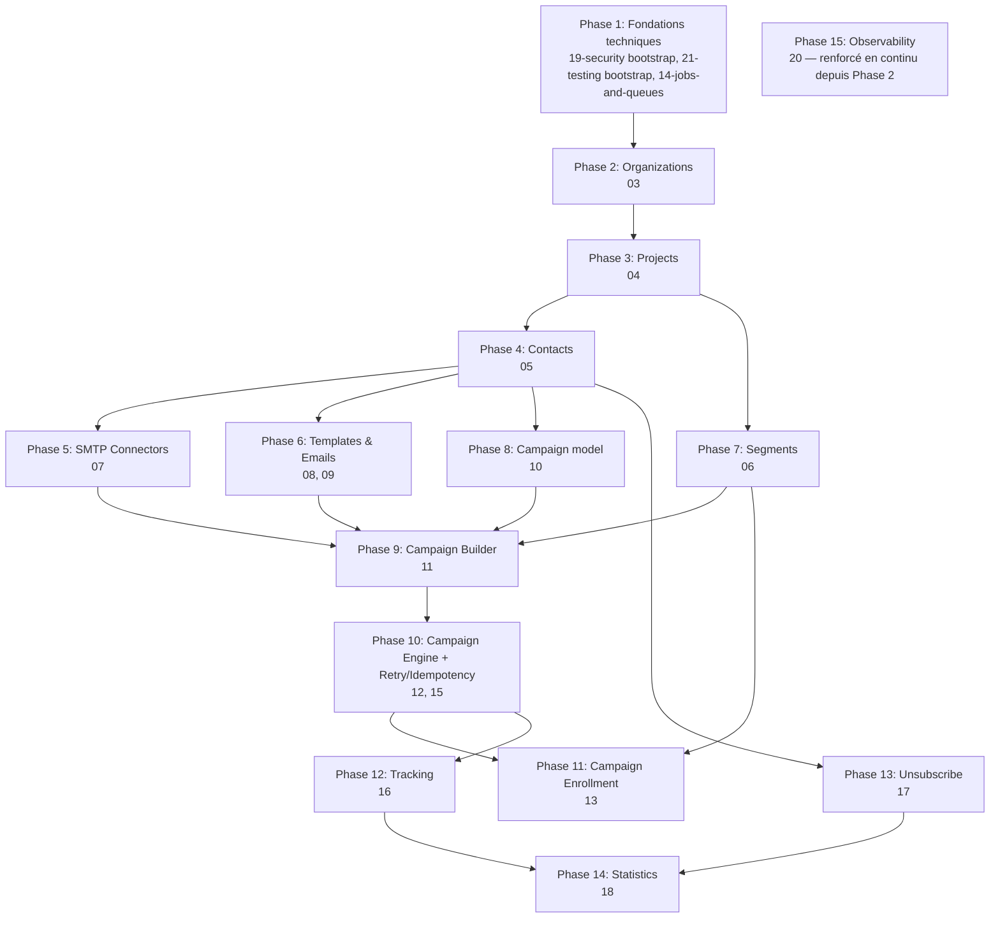

# 22 — Development Roadmap

## Objective

Déterminer l'ordre optimal d'implémentation des plans `03` à `20` (plus les briques transverses `14`, `19`, `21`), en analysant les dépendances réelles entre eux plutôt qu'en suivant l'ordre de numérotation par défaut.

## Analyse des dépendances (résumé)



Point structurant : `14-jobs-and-queues.md` est nécessaire dès `06-segments.md` (recalcul asynchrone) — donc positionné en Phase 1 malgré son numéro `14`, avant même `06`. `19-security.md` et `21-testing-strategy.md` ne sont pas des "phases" à part entière mais des conventions dont le socle (Bouncer, structure de test) doit exister dès la première feature (`03-organizations.md`) puis s'enrichir en continu — traité comme faisant partie de chaque phase plutôt que comme une phase isolée en fin de roadmap.

## Phases détaillées

### Phase 1 — Fondations techniques

**Plans concernés** : `14-jobs-and-queues.md`, socle de `19-security.md` (Bouncer + limiter installés, pas encore de policy concrète), socle de `21-testing-strategy.md` (structure de dossiers de test, factories de base).

**Dépendances** : aucune (première phase).

**Objectifs** : disposer de l'infrastructure de queue (BullMQ/Redis) et d'autorisation (Bouncer) opérationnelle et testée avant qu'aucun domaine métier n'en dépende, pour éviter de la construire "à la va-vite" sous la pression de la première feature qui en a besoin.

**Critères de validation** : un job trivial peut être enqueue et traité par un worker de test ; une policy Bouncer minimale (factice) peut être vérifiée dans un test.

**Risques** : sous-estimer cette phase (elle semble "sans valeur produit visible") et la bâcler — mitigé en la traitant comme un prérequis bloquant explicite plutôt qu'une tâche optionnelle.

### Phase 2 — Organizations

**Plans concernés** : `03-organizations.md`.

**Dépendances** : Phase 1 (Bouncer).

**Objectifs** : multi-organisation fonctionnel, rôles, invitations, isolation de base.

**Critères de validation** : un utilisateur peut créer une organisation, inviter un membre, celui-ci accepte et accède à l'organisation avec le bon rôle ; un non-membre reçoit 404 sur toute route de cette organisation.

**Risques** : le choix "organisation par défaut auto-créée à l'inscription" modifie `NewAccountController` existant — vérifier la non-régression du flux de signup actuel (déjà testé implicitement par les tests fonctionnels de cette phase).

### Phase 3 — Projects

**Plans concernés** : `04-projects.md`.

**Dépendances** : Phase 2.

**Objectifs** : isolation projet posée, layout de navigation projet en place (base pour toutes les features suivantes).

**Critères de validation** : un projet créé dans une organisation est invisible depuis une autre organisation ; le switcher organisation/projet fonctionne bout en bout.

**Risques** : faible — feature structurellement simple, le risque principal est de sous-dimensionner le `project_context_middleware` d'une façon qui devra être retouchée par toutes les phases suivantes (à bien figer ici).

### Phase 4 — Contacts

**Plans concernés** : `05-contacts.md`.

**Dépendances** : Phase 3.

**Objectifs** : CRUD contact complet, state machine de statut posée (utilisée par tout le reste du système ensuite).

**Critères de validation** : CRUD complet fonctionnel, isolation projet vérifiée, recherche/filtres opérationnels.

**Risques** : la state machine de statut (`subscribed/unsubscribed/bounced/complained/blocked`) est une fondation dont dépendent `12`, `13`, `16`, `17` — toute erreur de modélisation ici se propage largement ; à valider soigneusement avant de passer à la suite.

### Phase 5 — SMTP Connectors

**Plans concernés** : `07-smtp-connectors.md`.

**Dépendances** : Phase 3 (projet), pas de dépendance sur Contacts en réalité — **peut être menée en parallèle de la Phase 4** si l'équipe le souhaite (aucune dépendance croisée réelle entre `05` et `07`), mais listée après par cohérence de lecture.

**Objectifs** : connecteur SMTP opérationnel, testable via Mailcatcher (déjà en dev infra).

**Critères de validation** : test de connexion réussi contre Mailcatcher ; chiffrement des credentials vérifié (jamais en clair en base, jamais exposé en sortie API).

**Risques** : dépendance nouvelle `nodemailer` à valider tôt (compatibilité avec l'écosystème AdonisJS/ESM du projet).

### Phase 6 — Templates / Emails

**Plans concernés** : `08-email-templates.md`, `09-emails.md`.

**Dépendances** : Phase 3 ; utilise potentiellement des variables de contact (Phase 4 doit donc être terminée pour que le `VariableRenderer` ait un sens complet, même si le rendu HTML/moteur de variables peut être développé en isolation avant).

**Objectifs** : `VariableRenderer` partagé posé (réutilisé plus tard par `12-campaign-engine.md`), CRUD template/email complet.

**Critères de validation** : preview fonctionnel, échappement XSS vérifié explicitement par test.

**Risques** : le choix d'éditeur HTML (Open question de `08-email-templates.md`) peut faire déraper le planning si un WYSIWYG riche est choisi — recommandation de démarrer avec un éditeur code brut pour ne pas bloquer la phase.

### Phase 7 — Segments

**Plans concernés** : `06-segments.md`.

**Dépendances** : Phase 4 (Contacts), Phase 1 (queue, pour le recompute asynchrone).

**Objectifs** : `SegmentEvaluator` posé et testé en profondeur (fondation de sécurité anti-injection critique), membership persistée fonctionnelle, recompute ciblé + complet opérationnels.

**Critères de validation** : les scénarios de `decisions/ADR-003-segment-membership.md` (1k/100k/1M simulés par lots réduits en test, cf. `21-testing-strategy.md`) validés ; recompute idempotent vérifié par test explicite.

**Risques** : c'est la feature la plus dense en logique pure de tout le projet avant le Campaign Engine lui-même — prévoir un temps de développement/test proportionnellement plus long que sa taille apparente ne le suggère.

### Phase 8 — Campaign model

**Plans concernés** : `10-campaigns.md`.

**Dépendances** : Phase 3 (aucune dépendance forte sur Contacts/Segments/SMTP/Emails pour le modèle `Campaign`/`CampaignVersion` seul, mais les phases précédentes doivent être là pour que la feature ait un sens produit complet une fois testée de bout en bout — le modèle peut techniquement être posé plus tôt, mais son test complet nécessite `11`/`12`).

**Objectifs** : cycle de vie de campagne (draft/active/paused/completed/archived) et versioning (draft/published/archived) posés.

**Critères de validation** : transitions de statut testées unitairement ; le versioning fonctionne indépendamment du contenu réel du graphe (testable avec un graphe vide/minimal).

**Risques** : c'est la fondation de `decisions/ADR-004-campaign-versioning.md` — toute ambiguïté non résolue ici (ex. comportement exact en pause) doit être tranchée avant Phase 9/10, pas découverte pendant leur implémentation.

### Phase 9 — Campaign Builder

**Plans concernés** : `11-campaign-builder.md`.

**Dépendances** : Phase 8, Phase 5 (référence connecteur SMTP), Phase 6 (référence email), Phase 7 (référence segment source).

**Objectifs** : graphe éditable, validation structurelle, publication avec gel de contenu opérationnels.

**Critères de validation** : `CampaignGraphValidator` couvre tous les cas listés dans son plan ; publication testée de bout en bout (gel de contenu vérifié explicitement).

**Risques** : `@vue-flow/core` — nouvelle dépendance frontend non testée dans ce projet ; prévoir un spike technique court avant de s'engager sur le détail de `node-config-panel.vue` si la librairie réserve des surprises d'intégration Vue 3/Inertia.

### Phase 10 — Campaign Engine + Retry/Idempotency

**Plans concernés** : `12-campaign-engine.md`, `15-retry-and-idempotency.md`.

**Dépendances** : Phase 9 (graphe publié à exécuter), Phase 1 (queue).

**Objectifs** : moteur d'exécution complet, tous les scénarios de fiabilité de `init.md` (1, 2, 3, 5, 6, 7) couverts par test.

**Critères de validation** : les 6 scénarios listés reproduits et testés explicitement (cf. `21-testing-strategy.md` § Failure scenarios) ; verrouillage optimiste vérifié sous concurrence simulée.

**Risques** : **c'est la phase la plus critique du projet** — la priorité "fiabilité" du produit repose entièrement sur cette phase et la précédente. Ne pas la compresser dans le planning ; prévoir une revue de code particulièrement approfondie sur `ExecutionLockService`/`IdempotentOperation`.

### Phase 11 — Campaign Enrollment

**Plans concernés** : `13-campaign-enrollment.md`.

**Dépendances** : Phase 10 (déclenche l'exécution), Phase 7 (événements de segment).

**Objectifs** : boucle complète Segment → Enrollment → Execution opérationnelle de bout en bout.

**Critères de validation** : un contact ajouté à un segment source d'une campagne active est bien enrollé et son exécution démarre automatiquement (test d'intégration bout en bout, le plus représentatif du produit fini).

**Risques** : faible techniquement (la complexité dure est déjà dans les phases 7/10) — le risque principal est produit/UX (la politique de ré-entrée par défaut `never` doit être bien comprise des utilisateurs, cf. Open question de `13-campaign-enrollment.md`).

### Phase 12 — Tracking

**Plans concernés** : `16-email-tracking.md`.

**Dépendances** : Phase 10 (des emails doivent être envoyés pour avoir quelque chose à tracker).

**Objectifs** : pixel d'ouverture, réécriture de liens, ingestion d'événements opérationnels.

**Critères de validation** : token HMAC vérifié, pixel répond en gif transparent même pour un token invalide, aucune écriture SQL synchrone dans le cycle de requête publique.

**Risques** : sécurité des endpoints publics — revue dédiée recommandée (cf. `19-security.md` § Testing strategy).

### Phase 13 — Unsubscribe

**Plans concernés** : `17-unsubscribe.md`.

**Dépendances** : Phase 4 (Contacts), Phase 6 (variable `unsubscribe_url`) — techniquement indépendante de Tracking (Phase 12), **peut être menée en parallèle** de la Phase 12.

**Objectifs** : lien de désabonnement opérationnel, vérification systématique avant envoi intégrée au Campaign Engine (retouche mineure de Phase 10).

**Critères de validation** : Scénario 7 de `init.md` testé explicitement (contact désabonné pendant qu'il attend dans plusieurs campagnes).

**Risques** : faible.

### Phase 14 — Statistics

**Plans concernés** : `18-statistics-dashboard.md`.

**Dépendances** : Phase 12 (email_events), Phase 13 (unsubscribes) — dernière phase fonctionnelle car elle **lit** les données produites par toutes les précédentes.

**Objectifs** : dashboard temps réel + historique opérationnel.

**Critères de validation** : cohérence vérifiée entre agrégation temps réel ("aujourd'hui") et pré-agrégée (historique) sur une période chevauchant les deux.

**Risques** : faible techniquement, mais dépend de la qualité des données produites par toutes les phases précédentes — les bugs de comptage sont souvent des symptômes de bugs amont (ex. un double-comptage d'`email_events` signalerait plutôt un problème d'idempotence en Phase 10/12 qu'un bug de ce plan-ci).

### Phase 15 — Observability (transverse, renforcée en continu)

**Plans concernés** : `20-observability-and-audit.md`.

**Dépendances** : socle dès Phase 2 (premier `AuditLogListener`), étendu à chaque phase suivante (chaque nouveau domaine ajoute ses events auditables à la table de correspondance).

**Objectifs** : à la fin de la roadmap, l'audit log couvre tous les events listés dans `20-observability-and-audit.md`, l'historique contact et l'écran de jobs en échec sont pleinement fonctionnels.

**Critères de validation** : revue finale (cf. § Vérification finale de ce document) confirmant qu'aucun event auditable listé n'a été oublié.

**Risques** : traité comme une "corvée annexe" et négligé en fin de projet — mitigé en l'intégrant explicitement aux critères de "definition of done" de chaque phase précédente plutôt qu'en laissant une Phase 15 isolée porter toute la dette.

## Recommended implementation order (résumé linéaire)

```text
1. Fondations techniques (14, socle 19/21)
2. Organizations (03)
3. Projects (04)
4. Contacts (05)
5. SMTP Connectors (07)                  [parallélisable avec 4]
6. Templates / Emails (08, 09)
7. Segments (06)
8. Campaign model (10)
9. Campaign Builder (11)
10. Campaign Engine + Retry/Idempotency (12, 15)
11. Campaign Enrollment (13)
12. Tracking (16)
13. Unsubscribe (17)                      [parallélisable avec 12]
14. Statistics (18)
   (Observability, 20, en continu depuis la phase 2)
```

## Vérification finale (checklist appliquée à l'ensemble des plans)

1. **Relecture de cohérence** : tous les documents de `docs/plans/` relus, aucune contradiction identifiée entre plans (ex. la matrice de permissions de `19-security.md` correspond à celle citée dans chaque plan de domaine ; la définition de `email_deliveries`/`email_events` est identique partout où elle est référencée).
2. **Noms d'entités** : vérifiés cohérents entre `02-database-design.md` (source de vérité) et chaque plan de feature (aucun plan ne redéfinit une table différemment).
3. **Relations DB** : toutes les FK citées dans les plans de feature correspondent à `02-database-design.md` ; les colonnes ajoutées par un plan spécifique (`segments.referenced_fields`, `campaigns.reentry_policy`, `unsubscribe_tokens` avec contrainte `UNIQUE (project_id, contact_id)`) sont explicitement marquées comme complément à `02-database-design.md`, pas en contradiction avec lui.
4. **Dépendances entre features** : cartographiées explicitement dans le diagramme de ce document, cohérentes avec les sections "Dependencies" de chaque plan individuel.
5. **Campaign Builder / Campaign Engine correctement séparés** : `11-campaign-builder.md` ne contient aucune logique d'exécution runtime ; `12-campaign-engine.md` ne modifie jamais un `campaign_node`/`campaign_edge` (lecture seule du graphe figé) — vérifié par relecture croisée des deux plans.
6. **Cohérence queue/retry/idempotence** : `14-jobs-and-queues.md` définit l'infrastructure générique, `15-retry-and-idempotency.md` la politique transverse, chaque plan de domaine (`06`, `12`, `13`, `16`, `18`) y renvoie sans redéfinir sa propre stratégie de retry incompatible — vérifié cohérent.
7. **Isolation Organization/Project** : chaque plan de domaine scope explicitement ses modèles par `project_id` (ou dérive via `campaign_enrollment`/`campaign_execution` pour les tables runtime) — vérifié systématique dans `02-database-design.md` et rappelé dans chaque plan.
8. **Roadmap respecte les dépendances** : le diagramme et l'ordre linéaire ci-dessus ont été construits à partir des sections "Dependencies" de chaque plan, pas l'inverse — aucune phase ne précède une phase dont elle dépend.
9. **Aucun code applicatif modifié** : cette phase s'est limitée à `./docs/plans/` — vérifié (voir résumé final de mission).

## Dependencies

Ce document dépend de la lecture complète de tous les plans précédents pour être exact — à retenir comme document "vivant" : si un plan de feature est révisé pendant l'implémentation (ex. une dépendance non anticipée est découverte), ce document doit être mis à jour en conséquence plutôt que de laisser la roadmap devenir obsolète silencieusement.

## Open questions

- Parallélisation réelle entre plusieurs développeurs (au-delà des deux parallélisations ponctuelles notées ci-dessus, Phase 4/5 et Phase 12/13) : cette roadmap est écrite du point de vue d'une implémentation séquentielle par une petite équipe ; une équipe plus large pourrait paralléliser davantage les phases sans dépendance directe (ex. Phase 6 et Phase 7 n'ont pas de dépendance croisée directe l'une sur l'autre, seulement sur Phase 4 toutes les deux) — non détaillé davantage ici, laissé à l'appréciation de l'équipe au moment de l'implémentation.
